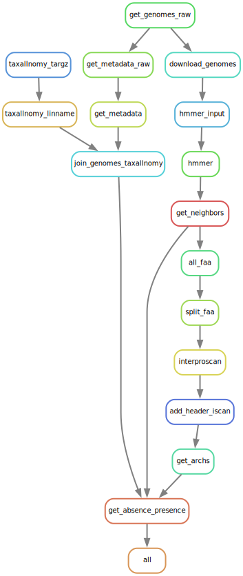

# :fishing_pole_and_fish: HOOX :fishing_pole_and_fish: 
## /hʊks/
### 0.0.1

> Meaning on an ocean full of genomes!

## Contents

- [Description](##Description)
- [Quick Usage](##Quick-Usage)
- [INPUTS](##INPUTS)
- [OUTPUTS](##OUTPUTS)
- [Installation](##Installation)

## Description

A [_snakemake pipeline_](https://snakemake.github.io/) capable of:

+ Downloading genomes
+ Searching a protein DB with Hidden Markov Model (HMM)
+ Domain annotation
+ Protein architecture Extraction
+ Gene-Neighborhood Extraction


The input to the pipeline is a text file providing the
assembly accessions of the target genomes
and a directory of the HMMs to be search.

The accessions could be obtained from NCBI databases.
And the HMMs from _interpro_ PFAMs or manually created
with _hmmer_.

It is used at [DeMoraes Lab](https://www.demoraeslab.org/) to search for cute interesting bacterial toxins.

### Rulegraph



## Quick Usage

###  Style 1: using config/config.yaml

Edit config/config.yaml and then run.
``` sh
snakemake --cores all
```

### Style 2: command line arguments

Specify configuration directly on the command line.
``` sh
snakemake --cores all\
          --config\
            genomes=genomes.txt\
            queries=queries
```

Style 1 is preferred as is the edited configuration
file act as log of the experiment, and makes
the pipeline reproducible.

Style 2 could be used for test runs.

## INPUTS

1. The input is a text file with no headers
and a genome assembly accession per line.
An example could be found at _tests/genomes.txt_.

The `#` character could be used for comments.

2. A directory of `.hmm` files. Those could be
obtained from  _interpro database_
or be manually generated from alignments.


## OUTPUTS

_TSV Tables_ summarizing the HMMs hits,
genome taxonomy and hits gene neighborhoods.

## Usage

### 1. Edit config/config.yaml
### 2. Run snakemake

``` sh
snakemake --cores all --configfile config/config.yaml
```

## Installation

Install the dependencies,
of them the one that requires the most setup is _interproscan.sh_,
(a helper script is provided).

Then the pipeline is run through the _snakemake_ framework.

### Cloud Installation

+ Check: https://github.com/elbecerrasoto/deploy-hoox

### Local Installation

1. Clone the repository.
``` sh
git clone 'https://github.com/elbecerrasoto/hoox'
cd hoox
```

2. Install an _Anaconda Distribution_.
I recommend _Miniforge_.
``` sh
make install-mamba
```

3. Install the _conda_ environment.
``` sh
~/miniforge3/bin/conda init
source ~/.bashrc
mamba shell init --shell bash --root-prefix=~/miniforge3
source ~/.bashrc
mamba env create
mamba activate hoox
```

4. Install _interproscan.sh_
``` sh
make install-iscan
```


5. Install R libraries.

``` sh
make install-Rlibs
```


5. Test the installation.

``` sh
make test
```

### Dependencies

A recommended way to get the dependencies
is by using the provided scripts and the `environment.yml` file.

``` sh
mamba env create -f environment.yml # Requires setting up mamba
mamba activate hoox # Requires setting up mamba
```


``` sh
utils/install_iscan.py
utils/install_Rlibs.R
```

#### snakemake

I recommend installing _snakemake_ through
an _Anaconda Distribution._

My favorite one is [_miniforge_](https://github.com/conda-forge/miniforge).

This _README_ uses _mamba_, but substitute by _conda_ if appropriately.

#### interproscan.sh

An installer script is provided.

#### ncbi-datasets cli

#### Linux utilities

+ pigz
+ gnu-make
+ aria2c

#### R

+ tidyverse
+ seqinr
+ segmenTools
+ data.table

#### python

+ pyhmmer
+ biopython
+ pandas
