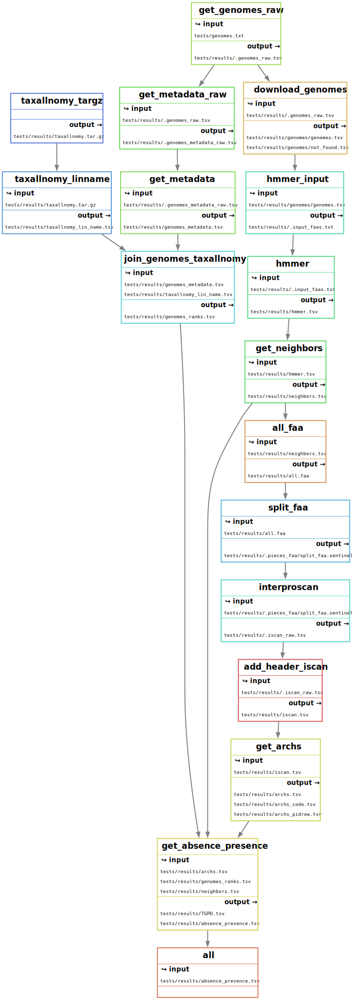

<h1 align="center">  </h1>

---

# pandoomain: the docs

---

## Contents

- [Input](#input)
    - [Assembly IDs](#assembly-ids)
    - [Domains](#domains)
    - [Configuration](#configuration)
- [Output](#output)
    -[Example of an Output Directory Structure](#example-of-an-output-directory-structure)
    -[Filegraph](#filegraph)
    -[Description of Key Output File](#description-of-key-output-files)

## Input

> Where/How to Obtain the Input?

The accession numbers can be obtained from NCBI databases.
HMMs can be sourced from _InterPro_, _PFAM_, or created from a sequence alignment using _HMMER_.

### Assembly IDs

Assembly IDs can be retrieved from the NCBI Taxonomy database
or by using the [`datasets` command-line NCBI utility](https://www.ncbi.nlm.nih.gov/datasets/docs/v2/command-line-tools/download-and-install/).

For example, this link provides assembly IDs for all Bacteria:

+ [NCBI Genomes](https://www.ncbi.nlm.nih.gov/datasets/genome/?taxon=2&typical_only=true&exclude_mags=true&exclude_multi_isolates=true)

Further refinement can be done via a web browser to obtain the exact required IDs.

#### Example of an Input `genomes.txt` File

```txt
GCF_001286845.1 # my favorite genome
GCA_021491795.1 # this is a comment
GCF_001585665.1 # negative on YwqJ & YwqL proteins
```

### Domains

For example, the _HMM_ for the _Pre-toxin TG domain_ (ID: _PF14449_) can be fetched from:

+ [PF14449](https://www.ebi.ac.uk/interpro/wwwapi//entry/pfam/PF14449?annotation=hmm)

#### Example of an Input `queries` Directory

```txt
queries
├── PF04493_EndoV.hmm
├── PF04740_LXG.hmm
├── PF14431_YwqJ.hmm
└── PF14449_PTTG.hmm
```

#### Example of an HMM File

The first 32 lines of `PF04493_EndoV.hmm`:

```txt
HMMER3/f [3.3 | Nov 2019]
NAME  Endonuclease_5
ACC   PF04493.19
DESC  Endonuclease V
LENG  198
ALPH  amino
RF    no
MM    no
CONS  yes
CS    yes
MAP   yes
DATE  Mon Jan  1 08:39:03 2024
NSEQ  128
EFFN  1.800781
CKSUM 1656237715
GA    23.4 23.4;
TC    23.4 23.5;
NC    23.3 23.3;
BM    hmmbuild HMM.ann SEED.ann
SM    hmmsearch -E 1000 -Z 81514348 --cpu 4 HMM pfamseq
STATS LOCAL MSV      -10.3625  0.70547
STATS LOCAL VITERBI  -11.2035  0.70547
STATS LOCAL FORWARD   -4.9016  0.70547
```

### Configuration

#### [`config/config.yaml`](../config/config.yaml)

To configure the pipeline edit the file at: [`config/config.yaml`](../config/config.yaml).

Of the configurtion options the most relevant is:
- **`n_neighbors`** which controls how many genes to return as neighbors.
    The returned genes are given *+N* positions upstream and *-N* positions downstream
    of the hit. Neighbors should be on the same contig, so for a big *N* 


This is an example `yaml` which contains all the options.
However if none if provided, default options for the pipeline could be found
at [`workflow/rules/globals.smk`](../workflow/rules/globals.smk)
```yaml
# Input genome list.
genomes:
  genomes.txt

# Directory of .hmm profiles.
queries:
  queries

# Where to store the results?
results:
  results

# Search this many neighbors
# upstream and downstream of any hit
n_neighbors:
  12

# Batch size (sequence entries per fasta)
# for interpro runs
batch_size:
  8000

# Fasta formatting
# NCBI uses 80
# but it's usually 60
# Default 80
faa_width:
  80

# Only use genomes
# from NCBI RefSeq assembly
only_refseq:
  false

# DO NOT trigger a fatal error
# on NO network access.
offline:
  false
```


#### Enviromental Variables

The script that downloads the genomes requires the following environmental variable:
+ `NCBI_DATASETS_APIKEY`

If the variable is not set, the script can still download the target genomes, but at a reduced speed.

According to NCBI documentation:

```
E-utils users are allowed 3 requests/second without an API key. Create an API key to increase your e-utils limit to 10 requests/second.
```

To set this up, add the following line to your shell configuration (e.g. `~/.bashrc`):

```sh
export NCBI_DATASETS_APIKEY="your_api_key_here"
```

---

## Output

### Example of an Output Directory Structure

```txt
results
├── absence_presence.tsv
├── all.faa
├── archs_code.tsv
├── archs_pidrow.tsv
├── archs.tsv
├── genomes
│   ├── GCA_001457635.1
│   │   ├── GCA_001457635.1.faa
│   │   └── GCA_001457635.1.gff
│   ├── GCA_021491795.1
│   │   ├── GCA_021491795.1.faa
│   │   └── GCA_021491795.1.gff
│   ├── GCF_000394295.1
│   │   ├── GCF_000394295.1.faa
│   │   └── GCF_000394295.1.gff
│   ├── GCF_001286845.1
│   │   ├── GCF_001286845.1.faa
│   │   └── GCF_001286845.1.gff
│   ├── genomes.tsv
│   └── not_found.tsv
├── genomes_metadata.tsv
├── genomes_ranks.tsv
├── hmmer.tsv
├── iscan.tsv
├── neighbors.tsv
├── taxallnomy_lin_name.tsv
├── taxallnomy.tar.gz
└── TGPD.tsv
```

### Filegraph

Relationships between rules and their output files:



### Description of Key Output Files

| File | Description | Main Columns |
| ----- | ----------- | ----------- |
| genomes_metadata.tsv | NCBI metadata about the assembly. | genome, tax_id |
| taxallnomy_lin_name.tsv | Data from [taxallnomy](https://sourceforge.net/projects/taxallnomy/). | tax_id, phylum, class, order, family, genus, species |
| genomes_ranks.tsv | Taxa of each assembly. | genome, tax_id |

Intermediary files and less critical ones are marked as hidden files (with a `.` prefix). They are not described as they are subject to change, serving mainly mechanistic roles to keep _pandoomain_ functional.

#### `genome_metadata.tsv`

Metadata of the genome assemblies.
The data is obtained using the [*datasets NCBI utility*](https://www.ncbi.nlm.nih.gov/datasets/docs/v2/command-line-tools/download-and-install/).

| genome | org | genus | tax_id | strain | status | level | date | owner | proj | completeness | contamination | cds | method | gc |
| --- | --- | --- | --- | --- | --- | --- | --- | --- | --- | --- | --- | --- | --- | --- |
| GCF_001286845.1 | Bacillus subtilis | Bacillus | 1423 | NA | current | Contig | 2015-08-31 | EBI | PRJEB9876 | 98.13 | 2.54 | 4061 | NA | 43.5 |
| GCF_001286885.1 | Bacillus subtilis | Bacillus | 1423 | NA | current | Contig | 2015-08-31 | EBI | PRJEB9876 | 97.91 | 2.54 | 3945 | NA | 44 |
| GCF_000394295.1 | Enterococcus faecalis EnGen0248 | Enterococcus | 1158629 | SF19 | current | Scaffold | 2013-05-15 | Broad Institute | PRJNA88885 | 99.5 | 0.05 | 3007 | allpaths v. R41985 | 37 |


#### `taxallnomy_lin_name.tsv`

Taxonomic information obtained from [taxallnomy](https://sourceforge.net/projects/taxallnomy/).


#### `genomes_ranks.tsv`

Taxonomic ranks per asssembly.

| genome | tax_id | superkingdom | Kin | sbKin | spPhy | phylum | sbPhy | inPhy | spCla | class | sbCla | inCla | Coh | sbCoh | spOrd | order | sbOrd | inOrd | prOrd | spFam | family | sbFam | Tri | sbTri | genus | sbGen | Sec | sbSec | Ser | sbSer | Sgr | sbSgr | species | Fsp | sbSpe | Var | sbVar | For | Srg | Srt | Str | Iso |
| --- | --- | --- | --- | --- | --- | --- | --- | --- | --- | --- | --- | --- | --- | --- | --- | --- | --- | --- | --- | --- | --- | --- | --- | --- | --- | --- | --- | --- | --- | --- | --- | --- | --- | --- | --- | --- | --- | --- | --- | --- | --- | --- |
| GCF_004214875.1 | 1193712 | Bacteria | Bacillati | sbKin_of_Mycoplasmatota | spPhy_of_Mycoplasmatota | Mycoplasmatota | sbPhy_of_Mollicutes | inPhy_of_Mollicutes | spCla_of_Mollicutes | Mollicutes | sbCla_of_Acholeplasmatales | inCla_of_Acholeplasmatales | Coh_of_Acholeplasmatales | sbCoh_of_Acholeplasmatales | spOrd_of_Acholeplasmatales | Acholeplasmatales | sbOrd_of_Acholeplasmataceae | inOrd_of_Acholeplasmataceae | prOrd_of_Acholeplasmataceae | spFam_of_Acholeplasmataceae | Acholeplasmataceae | sbFam_of_Candidatus Phytoplasma | Tri_of_Candidatus Phytoplasma | sbTri_of_Candidatus Phytoplasma | Candidatus Phytoplasma | sbGen_of_16SrI (Aster yellows group) | Sec_of_16SrI (Aster yellows group) | sbSec_of_16SrI (Aster yellows group) | Ser_of_16SrI (Aster yellows group) | sbSer_of_16SrI (Aster yellows group) | 16SrI (Aster yellows group) | sbSgr_of_'Catharanthus roseus' aster yellows phytoplasma | 'Catharanthus roseus' aster yellows phytoplasma | Fsp_in_'Catharanthus roseus' aster yellows phytoplasma | sbSpe_in_'Catharanthus roseus' aster yellows phytoplasma | Var_in_'Catharanthus roseus' aster yellows phytoplasma | sbVar_in_'Catharanthus roseus' aster yellows phytoplasma | For_in_'Catharanthus roseus' aster yellows phytoplasma | Srg_in_'Catharanthus roseus' aster yellows phytoplasma | Srt_in_'Catharanthus roseus' aster yellows phytoplasma | Str_in_'Catharanthus roseus' aster yellows phytoplasma | Iso_in_'Catharanthus roseus' aster yellows phytoplasma |
| GCF_000744065.1 | 1520703 | Bacteria | Bacillati | sbKin_of_Mycoplasmatota | spPhy_of_Mycoplasmatota | Mycoplasmatota | sbPhy_of_Mollicutes | inPhy_of_Mollicutes | spCla_of_Mollicutes | Mollicutes | sbCla_of_Acholeplasmatales | inCla_of_Acholeplasmatales | Coh_of_Acholeplasmatales | sbCoh_of_Acholeplasmatales | spOrd_of_Acholeplasmatales | Acholeplasmatales | sbOrd_of_Acholeplasmataceae | inOrd_of_Acholeplasmataceae | prOrd_of_Acholeplasmataceae | spFam_of_Acholeplasmataceae | Acholeplasmataceae | sbFam_of_Candidatus Phytoplasma | Tri_of_Candidatus Phytoplasma | sbTri_of_Candidatus Phytoplasma | Candidatus Phytoplasma | sbGen_of_16SrI (Aster yellows group) | Sec_of_16SrI (Aster yellows group) | sbSec_of_16SrI (Aster yellows group) | Ser_of_16SrI (Aster yellows group) | sbSer_of_16SrI (Aster yellows group) | 16SrI (Aster yellows group) | sbSgr_of_'Chrysanthemum coronarium' phytoplasma | 'Chrysanthemum coronarium' phytoplasma | Fsp_in_'Chrysanthemum coronarium' phytoplasma | sbSpe_in_'Chrysanthemum coronarium' phytoplasma | Var_in_'Chrysanthemum coronarium' phytoplasma | sbVar_in_'Chrysanthemum coronarium' phytoplasma | For_in_'Chrysanthemum coronarium' phytoplasma | Srg_in_'Chrysanthemum coronarium' phytoplasma | Srt_in_'Chrysanthemum coronarium' phytoplasma | Str_in_'Chrysanthemum coronarium' phytoplasma | Iso_in_'Chrysanthemum coronarium' phytoplasma |
| GCF_009268075.1 | 295320 | Bacteria | Bacillati | sbKin_of_Mycoplasmatota | spPhy_of_Mycoplasmatota | Mycoplasmatota | sbPhy_of_Mollicutes | inPhy_of_Mollicutes | spCla_of_Mollicutes | Mollicutes | sbCla_of_Acholeplasmatales | inCla_of_Acholeplasmatales | Coh_of_Acholeplasmatales | sbCoh_of_Acholeplasmatales | spOrd_of_Acholeplasmatales | Acholeplasmatales | sbOrd_of_Acholeplasmataceae | inOrd_of_Acholeplasmataceae | prOrd_of_Acholeplasmataceae | spFam_of_Acholeplasmataceae | Acholeplasmataceae | sbFam_of_Candidatus Phytoplasma | Tri_of_Candidatus Phytoplasma | sbTri_of_Candidatus Phytoplasma | Candidatus Phytoplasma | sbGen_unclassified Candidatus Phytoplasma | Sec_of_'Cynodon dactylon' phytoplasma | sbSec_of_'Cynodon dactylon' phytoplasma | Ser_of_'Cynodon dactylon' phytoplasma | sbSer_of_'Cynodon dactylon' phytoplasma | Sgr_of_'Cynodon dactylon' phytoplasma | sbSgr_of_'Cynodon dactylon' phytoplasma | 'Cynodon dactylon' phytoplasma | Fsp_in_'Cynodon dactylon' phytoplasma | sbSpe_in_'Cynodon dactylon' phytoplasma | Var_in_'Cynodon dactylon' phytoplasma | sbVar_in_'Cynodon dactylon' phytoplasma | For_in_'Cynodon dactylon' phytoplasma | Srg_in_'Cynodon dactylon' phytoplasma | Srt_in_'Cynodon dactylon' phytoplasma | Str_in_'Cynodon dactylon' phytoplasma | Iso_in_'Cynodon dactylon' phytoplasma |

#### `genomes/genomes.tsv`

Genomes that were downloaded,
and are ready for analysis.

| id | genome | refseq | version |
| --- | --- | --- | --- |
| 394295 | GCF_000394295.1 | True | 1 |
| 1286845 | GCF_001286845.1 | True | 1 |
| 1286885 | GCF_001286885.1 | True | 1 |


#### `genomes/not_found.tsv`

Genomes that weren't found, due to
having a unexistent ID or due to a network failure.

Usually _assembly IDs_ end on _0_ ar _5_ and the version number is tipycally at most _2_.

However the pipeline considers anything that match the following _regular expresion_:
+ `GC[AF]_\d+\.\d`


| id | genome | refseq | version |
| --- | --- | --- | --- |
| 175795 | GCF_000175795.2 | True | 2 |
| 175899 | GCF_000175899.3 | True | 3 |
| 175938 | GCA_000175938.4 | False | 4 |


#### `hmmer.tsv`

Table of proteins that
have a hit with the input query domains.

#### `neighbors.tsv`

Table of upstream and downstream
gene neighbors to the protein hits.

#### `all.faa`

FASTA file of all unique proteins
that were found by _pandoomain_,
including those that are neighbors to
the subject proteins (hits).

``` faa
>WP_000141959.1 TIGR01741 family protein [Staphylococcus aureus]
MTFEEKLNEMYNEIANKISGMIPVEWEKVYTMAYIDDEGGEVFYYYTEPGSTELYYYTSVLNKYDILESEFMDSAYELYK
QFQNLRELFIEEGLEPWTSCEFDFTREGELKVSFDYIDWINTEFDQLGRQNYYMYKKFGVIPEMEYEMEEVKEIEQYIKE
QDEAEL
>WP_000141960.1 TIGR01741 family protein [Staphylococcus aureus]
MTFEEKLNEMYNEIANKISGMIPVEWEKVYTMAYIDDEGGEVFYYYTEPGSTELYYYTSVLNKYDILESEFMDSAYELYK
QFQNLRELFIEEGLEPWTSCEFDFTREGELKVSFDYIDWINTEFDQLGRQNYYMYKKFGVIPEMEYEMEEVKQIEQYIKE
QEETNL
>WP_000141961.1 MULTISPECIES: TIGR01741 family protein [Staphylococcus]
MTFEEKLNEMYNEIANKISGMIPVEWEQVYTIAYVNDRGGEVIFNYTKPGSDELNYYTDISRDYNVSEEIFDDLWMNLYY
LFKNLRNLFKTEGHEPWTSCEFDFTRDGKLNVSFDYIDWIKLGLGPLARENYYMYKKFGVIPEMEEIKEIVQYIKEQDEA
EI
```

#### `iscan.tsv`

Domain annotation of
the proteins that were found by
_pandoomain_ (proteins contained on `all.faa`).

The annotation if performed by [`interproscan.sh`](https://github.com/ebi-pf-team/interproscan).

| pid | md5 | length | analysis | memberDB | memberDB_txt | start | end | score | recommended | date | interpro | interpro_txt | GO | residue |
| --- | --- | --- | --- | --- | --- | --- | --- | --- | --- | --- | --- | --- | --- | --- |
| WP_231825678.1 | 83b0e6cc3855c39d370be75a9ecfb444 | 221 | Gene3D | G3DSA:3.30.2170.10 | archaeoglobus fulgidus dsm 4304 superfamily | 1 | 214 | 8.5E-92 | T | 05-11-2024 | - | - | - | - |
| WP_231825678.1 | 83b0e6cc3855c39d370be75a9ecfb444 | 221 | PANTHER | PTHR28511 | ENDONUCLEASE V | 5 | 211 | 1.3E-51 | T | 05-11-2024 | IPR007581 | Endonuclease V | GO:0003727(PANTHER)|GO:0004519(InterPro)|GO:0006281(InterPro)|GO:0016891(PANTHER)|GO:0043737(PANTHER) | - |
| WP_231825678.1 | 83b0e6cc3855c39d370be75a9ecfb444 | 221 | CDD | cd06559 | Endonuclease_V | 3 | 211 | 2.33121E-104 | T | 05-11-2024 | IPR007581 | Endonuclease V | GO:0004519(InterPro)|GO:0006281(InterPro) | - |

#### `archs.tsv`

| pid | domain | order | start | end | length | domain_txt |
| --- | --- | --- | --- | --- | --- | --- |
| NP_312948.1 | PF04493 | 1 | 12 | 206 | 223 | Endonuclease V |
| NP_388563.2 | PF04740 | 1 | 2 | 201 | 669 | LXG domain of WXG superfamily |
| NP_388563.2 | PF13930 | 2 | 525 | 654 | 669 | DNA/RNA non-specific endonuclease |

#### `archs_pid_row.tsv`

| pid | arch | ndoms | length | arch_code |
| --- | --- | --- | --- | --- |
| NP_312948.1 | PF04493 | 1 | 223 | Ţ |
| NP_388563.2 | PF04740,PF13930 | 2 | 669 | ťě |
| NP_389781.1 | PF04740,PF14411 | 2 | 600 | ťċ |


#### `archs_code.tsv`

| domain | letter |
| --- | --- |
| PF04493 | Ţ |
| PF04740 | ť |
| PF13930 | ě |

### `TGPD.tsv`

Short for _Taxa, Genome, Protein and Domain_. This table
joins those four things. In a way is a summary of all results.

| tax_id | genome | pid | domain |
| --- | --- | --- | --- |
| 1193712 | GCF_004214875.1 | NA | NA |
| 1520703 | GCF_000744065.1 | NA | NA |
| 295320 | GCF_009268075.1 | NA | NA |

#### `absence_presence.tsv`

| genome | tax_id | species | PF00015 | PF00028 | PF00082 | PF00092 | PF00126 | PF00226 | PF00232 | PF00246 | PF00353 | PF00361 | PF00383 | PF00392 | PF00395 | PF00404 | PF00413 | PF00415 | PF00501 | PF00545 | PF00550 | PF00553 | PF00583 | PF00648 | PF00652 | PF00668 | PF00672 | PF00691 | PF00795 | PF00817 | PF00856 | PF00963 | PF01035 | PF01079 | PF01344 | PF01435 | PF01441 | PF01471 | PF01473 | PF01476 | PF01541 | PF01580 | PF01833 | PF01839 | PF01841 | PF01909 | PF02195 | PF02233 | PF02368 | PF02470 | PF02563 | PF02661 | PF02687 | PF03466 | PF03496 | PF03497 | PF03527 | PF03534 | PF03564 | PF04233 | PF04493 | PF04717 | PF04740 | PF04829 | PF04830 | PF05345 | PF05488 | PF05521 | PF05593 | PF05594 | PF05860 | PF05954 | PF06013 | PF06037 | PF06259 | PF07461 | PF07508 | PF07591 | PF07661 | PF08239 | PF09000 | PF09136 | PF09346 | PF09533 | PF10145 | PF11311 | PF11429 | PF11798 | PF12106 | PF12255 | PF12256 | PF12639 | PF12698 | PF12729 | PF12802 | PF12836 | PF13018 | PF13125 | PF13193 | PF13205 | PF13332 | PF13385 | PF13395 | PF13408 | PF13432 | PF13488 | PF13517 | PF13640 | PF13665 | PF13699 | PF13753 | PF13780 | PF13930 | PF13946 | PF14021 | PF14029 | PF14107 | PF14410 | PF14411 | PF14412 | PF14414 | PF14424 | PF14431 | PF14433 | PF14436 | PF14437 | PF14448 | PF14449 | PF14517 | PF14657 | PF14751 | PF15524 | PF15526 | PF15529 | PF15532 | PF15534 | PF15538 | PF15540 | PF15542 | PF15545 | PF15604 | PF15605 | PF15607 | PF15633 | PF15636 | PF15637 | PF15640 | PF15643 | PF15644 | PF15647 | PF15648 | PF15649 | PF15650 | PF15652 | PF15653 | PF15657 | PF16640 | PF16888 | PF17642 | PF17957 | PF17963 | PF18431 | PF18451 | PF18664 | PF18798 | PF18807 | PF18884 | PF18998 | PF19127 | PF19458 | PF20041 | PF20148 | PF20410 | PF21111 | PF21431 | PF21724 | PF21725 | PF21814 | PF22148 | PF22178 | PF22596 | PF22783 | superkingdom | phylum | class | order | family | genus |
| --- | --- | --- | --- | --- | --- | --- | --- | --- | --- | --- | --- | --- | --- | --- | --- | --- | --- | --- | --- | --- | --- | --- | --- | --- | --- | --- | --- | --- | --- | --- | --- | --- | --- | --- | --- | --- | --- | --- | --- | --- | --- | --- | --- | --- | --- | --- | --- | --- | --- | --- | --- | --- | --- | --- | --- | --- | --- | --- | --- | --- | --- | --- | --- | --- | --- | --- | --- | --- | --- | --- | --- | --- | --- | --- | --- | --- | --- | --- | --- | --- | --- | --- | --- | --- | --- | --- | --- | --- | --- | --- | --- | --- | --- | --- | --- | --- | --- | --- | --- | --- | --- | --- | --- | --- | --- | --- | --- | --- | --- | --- | --- | --- | --- | --- | --- | --- | --- | --- | --- | --- | --- | --- | --- | --- | --- | --- | --- | --- | --- | --- | --- | --- | --- | --- | --- | --- | --- | --- | --- | --- | --- | --- | --- | --- | --- | --- | --- | --- | --- | --- | --- | --- | --- | --- | --- | --- | --- | --- | --- | --- | --- | --- | --- | --- | --- | --- | --- | --- | --- | --- | --- | --- | --- | --- | --- | --- | --- | --- | --- | --- | --- | --- | --- | --- | --- | --- | --- | --- |
| GCF_004214875.1 | 1193712 | 'Catharanthus roseus' aster yellows phytoplasma | FALSE | FALSE | FALSE | FALSE | FALSE | FALSE | FALSE | FALSE | FALSE | FALSE | FALSE | FALSE | FALSE | FALSE | FALSE | FALSE | FALSE | FALSE | FALSE | FALSE | FALSE | FALSE | FALSE | FALSE | FALSE | FALSE | FALSE | FALSE | FALSE | FALSE | FALSE | FALSE | FALSE | FALSE | FALSE | FALSE | FALSE | FALSE | FALSE | FALSE | FALSE | FALSE | FALSE | FALSE | FALSE | FALSE | FALSE | FALSE | FALSE | FALSE | FALSE | FALSE | FALSE | FALSE | FALSE | FALSE | FALSE | FALSE | FALSE | FALSE | FALSE | FALSE | FALSE | FALSE | FALSE | FALSE | FALSE | FALSE | FALSE | FALSE | FALSE | FALSE | FALSE | FALSE | FALSE | FALSE | FALSE | FALSE | FALSE | FALSE | FALSE | FALSE | FALSE | FALSE | FALSE | FALSE | FALSE | FALSE | FALSE | FALSE | FALSE | FALSE | FALSE | FALSE | FALSE | FALSE | FALSE | FALSE | FALSE | FALSE | FALSE | FALSE | FALSE | FALSE | FALSE | FALSE | FALSE | FALSE | FALSE | FALSE | FALSE | FALSE | FALSE | FALSE | FALSE | FALSE | FALSE | FALSE | FALSE | FALSE | FALSE | FALSE | FALSE | FALSE | FALSE | FALSE | FALSE | FALSE | FALSE | FALSE | FALSE | FALSE | FALSE | FALSE | FALSE | FALSE | FALSE | FALSE | FALSE | FALSE | FALSE | FALSE | FALSE | FALSE | FALSE | FALSE | FALSE | FALSE | FALSE | FALSE | FALSE | FALSE | FALSE | FALSE | FALSE | FALSE | FALSE | FALSE | FALSE | FALSE | FALSE | FALSE | FALSE | FALSE | FALSE | FALSE | FALSE | FALSE | FALSE | FALSE | FALSE | FALSE | FALSE | FALSE | FALSE | FALSE | FALSE | FALSE | FALSE | FALSE | Bacteria | Mycoplasmatota | Mollicutes | Acholeplasmatales | Acholeplasmataceae | Candidatus Phytoplasma |
| GCF_000744065.1 | 1520703 | 'Chrysanthemum coronarium' phytoplasma | FALSE | FALSE | FALSE | FALSE | FALSE | FALSE | FALSE | FALSE | FALSE | FALSE | FALSE | FALSE | FALSE | FALSE | FALSE | FALSE | FALSE | FALSE | FALSE | FALSE | FALSE | FALSE | FALSE | FALSE | FALSE | FALSE | FALSE | FALSE | FALSE | FALSE | FALSE | FALSE | FALSE | FALSE | FALSE | FALSE | FALSE | FALSE | FALSE | FALSE | FALSE | FALSE | FALSE | FALSE | FALSE | FALSE | FALSE | FALSE | FALSE | FALSE | FALSE | FALSE | FALSE | FALSE | FALSE | FALSE | FALSE | FALSE | FALSE | FALSE | FALSE | FALSE | FALSE | FALSE | FALSE | FALSE | FALSE | FALSE | FALSE | FALSE | FALSE | FALSE | FALSE | FALSE | FALSE | FALSE | FALSE | FALSE | FALSE | FALSE | FALSE | FALSE | FALSE | FALSE | FALSE | FALSE | FALSE | FALSE | FALSE | FALSE | FALSE | FALSE | FALSE | FALSE | FALSE | FALSE | FALSE | FALSE | FALSE | FALSE | FALSE | FALSE | FALSE | FALSE | FALSE | FALSE | FALSE | FALSE | FALSE | FALSE | FALSE | FALSE | FALSE | FALSE | FALSE | FALSE | FALSE | FALSE | FALSE | FALSE | FALSE | FALSE | FALSE | FALSE | FALSE | FALSE | FALSE | FALSE | FALSE | FALSE | FALSE | FALSE | FALSE | FALSE | FALSE | FALSE | FALSE | FALSE | FALSE | FALSE | FALSE | FALSE | FALSE | FALSE | FALSE | FALSE | FALSE | FALSE | FALSE | FALSE | FALSE | FALSE | FALSE | FALSE | FALSE | FALSE | FALSE | FALSE | FALSE | FALSE | FALSE | FALSE | FALSE | FALSE | FALSE | FALSE | FALSE | FALSE | FALSE | FALSE | FALSE | FALSE | FALSE | FALSE | FALSE | FALSE | FALSE | FALSE | FALSE | FALSE | Bacteria | Mycoplasmatota | Mollicutes | Acholeplasmatales | Acholeplasmataceae | Candidatus Phytoplasma |
| GCF_009268075.1 | 295320 | 'Cynodon dactylon' phytoplasma | FALSE | FALSE | FALSE | FALSE | FALSE | FALSE | FALSE | FALSE | FALSE | FALSE | FALSE | FALSE | FALSE | FALSE | FALSE | FALSE | FALSE | FALSE | FALSE | FALSE | FALSE | FALSE | FALSE | FALSE | FALSE | FALSE | FALSE | FALSE | FALSE | FALSE | FALSE | FALSE | FALSE | FALSE | FALSE | FALSE | FALSE | FALSE | FALSE | FALSE | FALSE | FALSE | FALSE | FALSE | FALSE | FALSE | FALSE | FALSE | FALSE | FALSE | FALSE | FALSE | FALSE | FALSE | FALSE | FALSE | FALSE | FALSE | FALSE | FALSE | FALSE | FALSE | FALSE | FALSE | FALSE | FALSE | FALSE | FALSE | FALSE | FALSE | FALSE | FALSE | FALSE | FALSE | FALSE | FALSE | FALSE | FALSE | FALSE | FALSE | FALSE | FALSE | FALSE | FALSE | FALSE | FALSE | FALSE | FALSE | FALSE | FALSE | FALSE | FALSE | FALSE | FALSE | FALSE | FALSE | FALSE | FALSE | FALSE | FALSE | FALSE | FALSE | FALSE | FALSE | FALSE | FALSE | FALSE | FALSE | FALSE | FALSE | FALSE | FALSE | FALSE | FALSE | FALSE | FALSE | FALSE | FALSE | FALSE | FALSE | FALSE | FALSE | FALSE | FALSE | FALSE | FALSE | FALSE | FALSE | FALSE | FALSE | FALSE | FALSE | FALSE | FALSE | FALSE | FALSE | FALSE | FALSE | FALSE | FALSE | FALSE | FALSE | FALSE | FALSE | FALSE | FALSE | FALSE | FALSE | FALSE | FALSE | FALSE | FALSE | FALSE | FALSE | FALSE | FALSE | FALSE | FALSE | FALSE | FALSE | FALSE | FALSE | FALSE | FALSE | FALSE | FALSE | FALSE | FALSE | FALSE | FALSE | FALSE | FALSE | FALSE | FALSE | FALSE | FALSE | FALSE | FALSE | FALSE | FALSE | Bacteria | Mycoplasmatota | Mollicutes | Acholeplasmatales | Acholeplasmataceae | Candidatus Phytoplasma |

